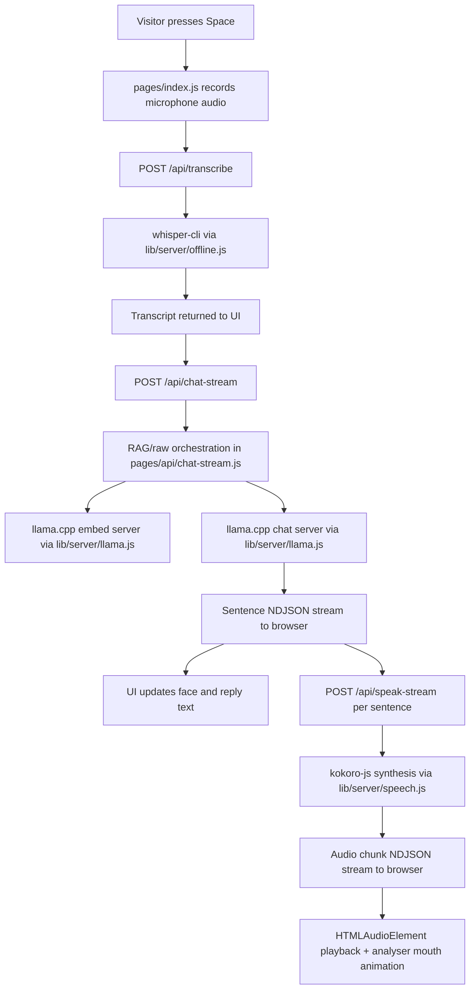

# iRipple Bot Code Documentation

## 1. App Purpose

`iripple-bot` is an offline, booth-style voice assistant built for iRipple demos and expo use.

Its main job is to:

- listen to a visitor through the microphone
- transcribe the visitor question locally
- answer only from local booth knowledge
- speak the answer back through a local text-to-speech pipeline
- present the conversation as an animated robot face with expression changes

The application is designed for low-latency kiosk use. It prefers local inference over cloud services and includes a hidden admin surface for editing booth knowledge and rebuilding embeddings on the machine.

## 2. High-Level Design

At a high level, the app has 4 layers:

1. Visitor UI layer
   - The main page at `/` renders the robot face, handles keyboard-driven recording, plays speech, and shows optional debug panels.
2. Local orchestration layer
   - Next.js API routes coordinate transcription, RAG lookup, chat generation, speech generation, warmup, and admin tasks.
3. Local AI runtime layer
   - `whisper-cli` handles transcription.
   - `llama-server` handles chat and embedding generation.
   - `kokoro-js` handles speech synthesis.
4. Local storage layer
   - `data/knowledge.txt` stores raw booth knowledge.
   - `data/embeddings.json` stores chunked embeddings for RAG mode.
   - temp audio files are written under `tmp/`.

## 3. App Flow

### 3.1 Visitor Interaction Flow

1. The app loads `/`.
2. The UI immediately calls `/api/warmup` to pre-warm the chat model, embed model, speech runtime, and embedding store.
3. The visitor holds the space bar to start recording.
4. On key release, the app stops recording and sends the captured WebM audio to `/api/transcribe`.
5. The transcription result is sent to `/api/chat-stream`.
6. The server either:
   - answers from raw knowledge mode, or
   - performs RAG retrieval from the embedding store and then generates an answer.
7. As sentences stream back, the UI:
   - updates the on-screen reply
   - queues sentence-level speech requests through `/api/speak-stream`
   - animates the mouth using a Web Audio analyser during playback
8. When audio playback finishes and no more work is queued, the app returns to idle.

### 3.2 Hidden Admin Flow

1. Press `Ctrl + Shift + A` anywhere in the app.
2. `pages/_app.js` unlocks admin mode in `sessionStorage` and routes to `/admin`.
3. The admin page loads `/api/admin/status`.
4. An operator can:
   - edit `data/knowledge.txt`
   - save knowledge text
   - rebuild `data/embeddings.json`
5. Rebuild uses the local embedding model through llama.cpp and rewrites the embedding store.

### 3.3 Face / Expression Flow

The robot face does not simply mirror the model mood tag. It combines:

- UI stage such as `idle`, `listening`, `processing`, `speaking`, `error`
- the model mood tag such as `[HAPPY]`, `[SURPRISED]`, `[THINKING]`
- transcript sentiment such as compliment detection
- unsupported-answer detection
- repeated irrelevant-question detection

The rounded and pixelized faces both support:

- `happy`
- `sad`
- `surprised`
- `thinking`
- `curious`
- `heartEyes`
- `mad`
- `apologetic`

Idle mode rotates between `happy`, `curious`, and `heartEyes`, with periodic blinks.

## 4. High-Level Architecture

## 5. Runtime Modes

### 5.1 Knowledge Modes

The app supports 2 knowledge modes from `lib/knowledge-mode.js`:

- `rag`
  - Default mode.
  - Retrieves relevant chunks from `data/embeddings.json`.
  - Safer for focused booth questions.
- `raw`
  - Sends the full `knowledge.txt` content as the primary source.
  - Useful for debugging or small knowledge files.

### 5.2 Primary UI Stages

The main page uses a stage state machine:

- `idle`
  - Waiting for user input.
- `listening`
  - Recording microphone input.
- `processing`
  - Waiting for transcription, retrieval, or generation.
- `speaking`
  - Playing generated audio.
- `error`
  - A local pipeline failure occurred.

## 6. File and Module Responsibilities

### 6.1 UI Pages

#### `pages/index.js`

This is the main visitor-facing application shell.

Responsibilities:

- stores UI state for stage, reply, transcript, mood, error, timings, mouth motion, and irrelevant-question streak
- manages local preferences with `localStorage` and `useSyncExternalStore`
- records microphone audio through `MediaRecorder`
- sends audio to `/api/transcribe`
- streams chat through `/api/chat-stream`
- streams speech through `/api/speak-stream`
- manages speech playback queues and partial sentence playback
- computes mouth motion from live audio waveform data
- renders `RobotFace`
- handles hotkeys:
  - `Space` for push-to-talk
  - `Ctrl + Shift + D` for debug overlay

#### `pages/admin.js`

This is the hidden booth-operator page.

Responsibilities:

- requires `sessionStorage` unlock set by `_app.js`
- loads current admin state from `/api/admin/status`
- edits knowledge text
- triggers save via `/api/admin/knowledge`
- triggers embedding rebuild via `/api/admin/embed`
- displays knowledge path, embedding path, chunk count, and last build time

#### `pages/_app.js`

Responsibilities:

- imports global CSS
- globally listens for `Ctrl + Shift + A`
- toggles the hidden admin page on and off

#### `pages/_document.js`

Responsibilities:

- sets HTML language
- sets body classes used by the kiosk UI

### 6.2 Main Visual Component

#### `components/RobotFace.js`

This is the full robot renderer and face-expression engine.

Responsibilities:

- derives the expression from stage, mood, transcript, and reply
- rotates idle expressions with `useIdleExpression`
- animates blinks with `useFaceMotion`
- applies subtle speaking motion to eyes and brows
- renders 2 face styles:
  - rounded face
  - pixelized face
- renders debug overlays and control buttons

Key expression rules:

- `idle` rotates among `happy`, `curious`, `heartEyes`
- compliments trigger `heartEyes`
- unsupported answers trigger `apologetic`
- repeated unsupported answers escalate to `mad`
- processing and `[THINKING]` use `thinking`
- hard errors use `sad`
- speaking defaults to `happy`

### 6.3 API Routes

#### `pages/api/transcribe.js`

Transcribes uploaded audio into text.

Flow:

1. Parse multipart upload with `formidable`.
2. Write uploaded audio to `tmp/`.
3. Convert WebM to mono 16 kHz WAV with `ffmpeg`.
4. Run `whisper-cli` against the WAV.
5. Clean the CLI output into plain text.
6. Return text and timings.

#### `pages/api/chat-stream.js`

This is the primary answer-generation endpoint used by the UI.

Response format:

- NDJSON stream
- event types:
  - `meta`
  - `sentence`
  - `done`
  - `error`

Responsibilities:

- loads raw knowledge or embedding store
- uses in-memory response caching
- performs embedding-store compatibility checks
- performs query embedding and chunk ranking
- enforces a confidence gate before allowing RAG answers
- falls back to safe refusal replies when confidence is low
- streams sentence-level answer progress to the browser

This endpoint is central to the app.

#### `pages/api/chat.js`

This is the non-streaming chat variant.

Responsibilities:

- runs a single RAG query
- generates one full reply
- returns JSON instead of streaming

Current role:

- legacy or compatibility endpoint
- not the primary path used by the visitor UI

#### `pages/api/speak-stream.js`

Streams speech as NDJSON chunks.

Responsibilities:

- splits text into speech-sized chunks
- optionally emits filler speech
- synthesizes speech with Kokoro
- emits chunk-level WAV audio as base64
- reports timing markers for first chunk and total generation

This is the primary TTS path used by the UI.

#### `pages/api/speak.js`

Non-streaming speech endpoint.

Current role:

- compatibility/simple TTS endpoint
- not the primary path used by the visitor UI

#### `pages/api/warmup.js`

Warms the local runtime.

Responsibilities:

- resolves chat and embed models
- warms llama.cpp chat server
- warms llama.cpp embedding server
- loads the embedding store
- primes the Kokoro speech runtime and first filler phrase

#### `pages/api/admin/status.js`

Returns current admin/editor state:

- `knowledge.txt` path
- `embeddings.json` path
- raw knowledge text
- embedding chunk count
- last build metadata

#### `pages/api/admin/knowledge.js`

Writes new knowledge text to `data/knowledge.txt`.

#### `pages/api/admin/embed.js`

Rebuilds the embedding store.

Flow:

1. Load knowledge text.
2. Chunk it using configured chunk size and overlap.
3. Generate embeddings for each chunk through llama.cpp.
4. Write a fresh `data/embeddings.json`.

#### `pages/api/hello.js`

Default sample endpoint from Next.js. It is not part of the core booth flow.

### 6.4 Server Helpers

#### `lib/server/rag.js`

RAG data access and text normalization layer.

Responsibilities:

- ensure and read `knowledge.txt`
- ensure and read `embeddings.json`
- write updated knowledge and embedding data
- chunk knowledge text into overlapping sections
- compute cosine similarity
- select top matching chunks
- validate embedding store compatibility
- normalize LLM replies into a `{ mood, text, reply }` shape

#### `lib/server/llama.js`

llama.cpp runtime manager and transport layer.

Responsibilities:

- resolve configured model aliases and GGUF paths
- start and reuse dedicated `llama-server` processes for:
  - chat
  - embeddings
- wait for server health readiness
- call `/v1/embeddings`
- call `/v1/chat/completions`
- support streaming SSE parsing for chat generation
- warm both chat and embedding models

Important design choice:

- chat and embedding workloads run against separate llama.cpp server instances and ports
- server processes are cached globally in `globalThis` to survive route re-entry within the Node process

#### `lib/server/speech.js`

Speech orchestration and caching layer.

Responsibilities:

- define default Kokoro voice and speed
- split long text into speech-friendly chunks
- manage in-memory speech cache
- deduplicate concurrent synthesis requests
- provide filler phrases
- prime the speech cache

#### `lib/server/kokoro-node.js`

Thin wrapper around `kokoro-js`.

Responsibilities:

- lazily load Kokoro runtime
- configure Hugging Face cache directory
- build a singleton TTS instance
- synthesize WAV buffers

#### `lib/server/offline.js`

Local runtime and filesystem utility layer.

Responsibilities:

- define important file paths and temp paths
- ensure `data/` and `tmp/` exist
- initialize default `knowledge.txt` and `embeddings.json`
- resolve system binaries like:
  - `ffmpeg`
  - `whisper-cli`
  - `llama-server`
  - `brew`
- run child processes safely
- resolve Whisper model paths
- prepare Whisper-specific environment variables

#### `lib/server/timing.js`

Simple performance tracker used across API routes.

Responsibilities:

- mark named checkpoints
- produce timing snapshots
- emit consistent console perf logs

#### `lib/server/chat-prompt.js`

Prompt-construction layer for chat generation.

Responsibilities:

- build shared system instructions
- enforce mood-tag format
- constrain reply length
- require short first two sentences
- build raw-mode and RAG-mode prompts

#### `lib/knowledge-mode.js`

Small shared constants file for `rag` and `raw` mode normalization.

## 7. Data Files

### `data/knowledge.txt`

Plain-text source of booth knowledge.

Used by:

- raw knowledge mode directly
- embedding rebuild pipeline as the chunk source

### `data/embeddings.json`

Structured embedding store with metadata.

Current fields include:

- `version`
- `createdAt`
- `embedModel`
- `embedModelPath`
- `chunkSize`
- `overlap`
- `chunks`

Each chunk stores:

- `id`
- `text`
- `embedding`

## 8. Detailed Runtime Flow

### 8.1 Startup Flow

1. Next.js loads `pages/_app.js`.
2. Global CSS is applied from `styles/globals.css`.
3. `pages/index.js` mounts.
4. Stored preferences are read from localStorage:
   - face style
   - filler speech preference
   - knowledge mode
5. `/api/warmup` is called in the background.
6. Warmup:
   - resolves models
   - starts/reuses llama servers
   - loads embedding store
   - primes Kokoro and filler audio cache

### 8.2 Push-to-Talk Flow

1. `keydown` with `Space` triggers `startRecording()`.
2. `getUserMedia()` returns a microphone stream.
3. `MediaRecorder` starts collecting WebM chunks.
4. UI stage becomes `listening`.
5. `keyup` with `Space` triggers `stopRecording()`.
6. Recorder stops and the mic tracks are closed.
7. UI stage becomes `processing`.
8. Audio blob is posted to `/api/transcribe`.

### 8.3 Transcription Flow

1. `formidable` parses the upload.
2. Uploaded audio is moved to a temp input path.
3. `ffmpeg` converts it to mono WAV.
4. `whisper-cli` transcribes it.
5. Timestamp-like console artifacts are stripped from stdout.
6. Plain transcript text is returned to the browser.
7. UI stores transcript and timing metrics.

### 8.4 Chat / RAG Flow

1. `sendAudioToBackend()` starts `/api/chat-stream`.
2. In parallel, optional filler speech may be started.
3. `chat-stream` loads either:
   - full `knowledge.txt` for raw mode, or
   - `embeddings.json` for RAG mode
4. If in RAG mode and embeddings exist:
   - embed model is resolved
   - embedding store compatibility is checked
   - query text is embedded
   - top chunks are selected by cosine similarity
5. Confidence gates are applied:
   - minimum chunk score
   - top score threshold
   - keyword support
   - retail-context heuristics
   - FAQ heuristic for short questions
6. If confidence is too low:
   - the system returns a refusal-style response instead of guessing
7. If confidence is acceptable:
   - chat model is called through streaming completions
   - `meta` is sent once a mood tag is detected
   - complete sentences are emitted as `sentence` events
   - final normalized reply is emitted in `done`

### 8.5 Speech Flow

1. Each sentence event from chat is passed to `enqueueSpeechText()`.
2. Sentences are queued locally in the browser.
3. `drainSpeechQueue()` requests `/api/speak-stream` one sentence at a time.
4. `speak-stream`:
   - optionally emits filler phrase audio
   - splits text into speech chunks
   - synthesizes WAV buffers with Kokoro
   - returns base64 NDJSON chunks
5. The browser pushes those chunks into a playback queue.
6. `HTMLAudioElement` plays each WAV object URL in sequence.
7. A Web Audio `AnalyserNode` samples the waveform and updates mouth openness, width, smile, and lift during playback.

### 8.6 Expression / Mood Flow

The visible face expression is derived in this priority order:

1. `error` stage forces `sad`
2. `idle` stage rotates idle expressions
3. compliments force `heartEyes`
4. unsupported reply with repeated streak forces `mad`
5. unsupported reply otherwise uses `apologetic`
6. `processing` or `[THINKING]` uses `thinking`
7. `listening` uses `curious` or `thinking`
8. `[SURPRISED]` uses `surprised`
9. `speaking` uses `happy`
10. default fallback is `happy`

### 8.7 Admin Embedding Rebuild Flow

1. Operator opens `/admin`.
2. Admin page loads current knowledge and embedding metadata.
3. Operator edits the knowledge text.
4. Operator clicks rebuild.
5. `pages/api/admin/knowledge.js` saves the text.
6. `pages/api/admin/embed.js`:
   - chunks the text
   - embeds each chunk
   - writes a new embedding store
7. Future RAG queries now use the new chunk set.

## 9. Libraries and External Dependencies

### 9.1 NPM Libraries

- `next`
  - Pages Router app framework and API route host
- `react`
  - UI runtime
- `react-dom`
  - DOM renderer
- `formidable`
  - multipart form parsing for uploaded audio
- `kokoro-js`
  - local text-to-speech synthesis
- `tailwindcss`
  - styling system
- `@tailwindcss/postcss`
  - Tailwind PostCSS integration
- `eslint`
  - linting
- `eslint-config-next`
  - Next.js ESLint rules

### 9.2 External Binaries / Local Runtime Dependencies

These are required outside npm:

- `ffmpeg`
  - audio format conversion
- `whisper-cli`
  - local speech-to-text
- `llama-server`
  - local chat and embedding inference
- `brew`
  - optional helper for resolving Whisper Metal resources on macOS

### 9.3 Model Assets

- Whisper GGML model
- llama.cpp chat GGUF model
- llama.cpp embedding GGUF model
- Kokoro ONNX model from Hugging Face cache

## 10. Caching Strategy

The app uses multiple caches:

- response cache in `pages/api/chat-stream.js`
  - stores normalized chat replies by question + source version + knowledge mode
- response cache in `pages/api/chat.js`
  - legacy non-streaming response cache
- knowledge and embedding file caches in `lib/server/rag.js`
  - avoid repeated file parsing
- speech cache in `lib/server/speech.js`
  - stores synthesized WAV buffers by voice/speed/text
- pending speech cache in `lib/server/speech.js`
  - deduplicates simultaneous synthesis of the same chunk
- global llama server state in `lib/server/llama.js`
  - reuses active llama.cpp processes

## 11. Error Handling Strategy

The app prefers explicit safe failures over hallucinated answers.

Examples:

- missing transcript returns a local “did not catch that” reply
- low-confidence RAG returns an “I don’t know” style reply
- stale embeddings force rebuild instructions
- unavailable llama.cpp returns service errors
- mic access failure sets UI `error` stage
- speech and transcription errors are surfaced in the UI debug/error path

## 12. Observability and Timing

Performance instrumentation is built into most server routes.

Tracked areas include:

- transcription timing
- model resolution timing
- first token timing
- answer generation timing
- retrieval timing
- Kokoro start timing
- first audio chunk timing
- first browser playback timing

The browser also tracks:

- voice-end to transcription done
- voice-end to first speech chunk
- voice-end to first audio playback
- answer-start to speech request
- answer-start to Kokoro start

## 13. Current Architectural Notes

### Strengths

- fully local runtime path
- good separation between UI, orchestration, and runtime helpers
- streaming answer and streaming speech improve perceived latency
- admin tooling is built into the app
- explicit knowledge-confidence gate reduces unsupported answers

### Notable Tradeoffs

- several API routes are duplicated in streaming and non-streaming form
- admin unlock is convenience-based rather than secure authentication
- local in-memory caches are process-local and not persistent
- speech chunking and confidence heuristics are rule-based rather than learned

## 14. Important Current Defaults

- default face style: `pixelized`
- default filler speech: `off`
- default knowledge mode: `rag`
- default chat keep-alive: `10m`
- default speech voice: `af_sarah`
- default chunk size: `700`
- default overlap: `120`

## 15. Quick Route Reference

### UI Routes

- `/`
  - visitor kiosk UI
- `/admin`
  - hidden admin editor

### API Routes

- `/api/transcribe`
  - audio upload to transcript
- `/api/chat-stream`
  - primary streaming answer endpoint
- `/api/chat`
  - legacy non-streaming answer endpoint
- `/api/speak-stream`
  - primary streaming speech endpoint
- `/api/speak`
  - legacy non-streaming speech endpoint
- `/api/warmup`
  - runtime warmup
- `/api/admin/status`
  - admin metadata
- `/api/admin/knowledge`
  - save knowledge text
- `/api/admin/embed`
  - rebuild embeddings
- `/api/hello`
  - default sample route

## 16. Summary

The current codebase is a local-first expo robot built on the Next.js Pages Router. The main runtime loop is microphone capture -> Whisper transcription -> RAG or raw knowledge answer generation through llama.cpp -> sentence-level Kokoro speech streaming -> animated robot-face playback. The code is structured around a single kiosk page, a hidden admin editor, a streaming-first backend path, and a set of helper modules that isolate offline model execution, file management, caching, and timing.
