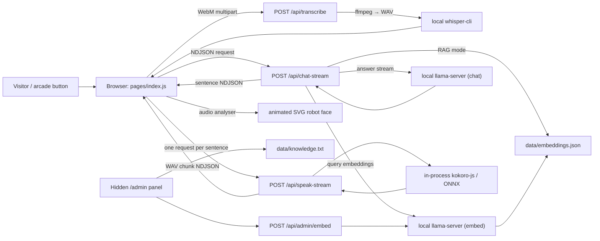

# iRipple Bot: Project Guide

## What this project is for

`iripple-bot` is an offline, booth-style voice assistant for iRipple retail-tech demos and expos. A visitor holds a physical arcade button (mapped to the **Space** key), asks a question, and the application:

1. records microphone audio in the browser;
2. transcribes it locally with Whisper;
3. answers from locally stored iRipple booth knowledge using local llama.cpp inference;
4. speaks the response through local Kokoro text-to-speech; and
5. shows the interaction on an animated robot face.

It is a Next.js 16 Pages Router application using React 19. It is designed to work without a hosted LLM, transcription API, or hosted vector database. The one exception to fully offline startup is Kokoro: its model may be downloaded and cached on first use unless it is already present in the configured Hugging Face cache.

The current knowledge source, `data/knowledge.txt`, contains iRipple product and company information. The assistant prompt requires answers to be grounded in that local source and to begin with one of `[HAPPY]`, `[SURPRISED]`, or `[THINKING]`.

## Architecture



### Runtime boundaries

| Layer | Responsibility | Main implementation |
| --- | --- | --- |
| Browser experience | Push-to-talk, streamed response/audio queues, timing display, mouth motion | `pages/index.js`, `lib/client/use-iripple-voice-assistant.js` |
| Robot UI | Chooses expressions and renders rounded or pixel SVG faces | `components/RobotFace.js`, `components/robot-face/` |
| Next API routes | Coordinates transcription, RAG/chat, speech, warmup, and admin operations | `pages/api/` |
| Local AI processes | Runs `whisper-cli` plus separate chat and embedding `llama-server` processes | `lib/server/offline.js`, `lib/server/llama-*.js` |
| Local content and caches | Stores knowledge, embeddings, temp audio, model/runtime caches, and in-memory response/audio caches | `data/`, `tmp/`, `.cache/huggingface/` |

## How to interact with it

### Visitor / kiosk interaction

- Open `/` (normally `http://localhost:3000`).
- Hold **Space** to record; release it to submit the audio. This is meant to be mapped to the physical arcade button.
- The page is deliberately hands-off in normal mode: it displays the robot face and speaks the answer.
- Press **Ctrl + Shift + D** to toggle the developer debug overlay. The overlay exposes the transcript, response, current stage, timing payloads, face-style switch, filler-speech switch, and knowledge-mode switch.
- The UI persists its debug preference controls in `localStorage`:
  - face style: `pixelized` by default or `rounded`;
  - filler speech: off by default;
  - knowledge mode: `rag` by default or `raw`.

The interaction stages are `idle`, `listening`, `processing`, `speaking`, and `error`. A Web Audio analyser measures outgoing audio volume to drive mouth openness while speaking.

### Operator interaction

- Press **Ctrl + Shift + A** to open `/admin`; use the same shortcut again to leave it.
- Edit the local knowledge text and select **Save knowledge text** to write `data/knowledge.txt`.
- Select **Rebuild embeddings** after changing knowledge, embedding model, chunk size, or overlap. This saves the text, chunks it, embeds every chunk locally, and rewrites `data/embeddings.json`.

The admin gate is a `sessionStorage` flag set by the keyboard shortcut. It is a kiosk convenience feature, not server-side authentication; do not expose this application or its admin endpoints publicly without adding real access control.

### Programmatic interaction

All endpoints use JSON unless noted below. They are intended primarily for the application itself.

| Endpoint | Method | Purpose / response |
| --- | --- | --- |
| `/api/warmup` | `POST` | Starts/warmups chat and embedding models, loads the embedding store, and primes Kokoro plus a filler phrase. |
| `/api/transcribe` | `POST` multipart | Requires `audio`; accepts browser WebM and returns `{ text, timings }`. |
| `/api/chat-stream` | `POST` | Takes `{ text, knowledgeMode }`; returns newline-delimited JSON with `meta`, sentence-level `sentence`, and `done` events. This is the visitor path. |
| `/api/chat` | `POST` | Legacy/non-streaming RAG chat: `{ text }` in, one JSON answer out. |
| `/api/speak-stream` | `POST` | Takes `{ text, voice?, fillerOnly?, useFiller? }`; returns WAV audio chunks as NDJSON. |
| `/api/speak` | `POST` | Takes `{ text, voice? }`; returns one `audio/wav` response. |
| `/api/admin/status` | `GET` | Returns knowledge text/path and embedding-store metadata. |
| `/api/admin/knowledge` | `POST` | Takes `{ text }` and updates the raw knowledge file. |
| `/api/admin/embed` | `POST` | Takes `{ embedModel?, chunkSize?, overlap? }` and builds the embedding store. |
| `/api/hello` | `GET` | Create-Next-App sample endpoint; not part of the assistant flow. |

## Answering and retrieval behavior

The default `rag` mode is the safer visitor mode:

1. `chat-stream` loads `data/embeddings.json`.
2. It resolves the selected embedding model and rejects the store if its model alias or model path no longer matches the stored metadata.
3. It embeds the question, scores all chunks with cosine similarity, and keeps up to three above the configured minimum score.
4. A confidence gate requires semantic/keyword support and retail context, with a small FAQ exception for short FAQ questions.
5. If confidence fails, the robot gives a local-knowledge refusal rather than calling the chat model.
6. Otherwise, it puts the selected chunks into a constrained prompt and streams the answer sentence by sentence.

`raw` mode bypasses retrieval and includes the complete `knowledge.txt` in the chat system prompt. It is useful for troubleshooting or a small knowledge base, but it gives the model more source text and has no retrieval confidence gate.

Both `/api/chat-stream` and `/api/chat` use bounded in-memory LRU-like response caches (maximum 200 entries). `lib/server/speech.js` separately caches up to 256 generated speech buffers and deduplicates in-flight synthesis requests.

## Key modules and files

### Entry points and user interface

| File | Why it matters |
| --- | --- |
| `pages/index.js` | Visitor page. Connects saved preferences and voice-assistant state to the robot face and hidden audio element. |
| `lib/client/use-iripple-voice-assistant.js` | Core browser controller. Handles microphone capture, API streams, speech/playback queues, timing aggregation, error state, hotkeys, and analyser-based mouth animation. |
| `components/RobotFace.js` | Composes the face, determines status labels, and renders the optional debug controls/panels. |
| `components/robot-face/expression.js` | Maps stage, model mood, compliments, and repeated unsupported questions to an expression. Two unsupported responses in succession escalate from apologetic to mad. |
| `components/robot-face/PixelFaceScreen.js` and `RoundedFaceScreen.js` | Two visual implementations of the same expression/motion contract. |
| `components/robot-face/hooks.js` | Idle-expression rotation, blinking, and subtle speaking motion. |
| `lib/client/preferences.js` and `lib/knowledge-mode.js` | Persist and normalize face, filler, and RAG/raw choices. |
| `pages/_app.js` | Global CSS plus the hidden-admin keyboard shortcut. |
| `pages/admin.js` | Operator interface for knowledge maintenance and embedding rebuilds. |

### Server and AI-runtime modules

| File | Why it matters |
| --- | --- |
| `pages/api/chat-stream.js` | Primary answer endpoint. It owns mode selection, retrieval gating, streaming NDJSON, sentence extraction, cache behavior, and response timings. |
| `pages/api/transcribe.js` | Parses the microphone upload, converts it to 16 kHz mono WAV with ffmpeg, runs Whisper, and removes temp files. |
| `pages/api/speak-stream.js` | Returns chunked, base64 WAV NDJSON for early playback; can prepend a filler phrase. |
| `lib/server/chat-prompt.js` | Defines the grounded persona and output limits/mood-tag contract. |
| `lib/server/chat-helpers.js` | Retrieval confidence heuristics, fallback messages, response parsing, and sentence splitting. |
| `lib/server/rag.js` | Knowledge-file I/O, embedding-store compatibility, text chunking, cosine scoring, and response normalization. |
| `lib/server/llama-config.js` | Turns environment settings/model aliases into `llama-server` configurations and CLI arguments. |
| `lib/server/llama-process.js` | Ensures one managed `llama-server` process each for chat and embeddings, restarts when config changes, and waits for health. |
| `lib/server/llama-transport.js` | OpenAI-compatible llama.cpp HTTP/SSE requests and stream parsing. |
| `lib/server/kokoro-node.js` and `speech.js` | Loads Kokoro ONNX, synthesizes WAV audio, splits speech text, and manages audio caches. |
| `lib/server/offline.js` | Local paths, data-file initialization, executable discovery, temp-file management, and Whisper model resolution. |
| `lib/server/timing.js` | Shared timing instrumentation used in API responses and logs. |

### Data, configuration, and styles

| File / directory | Purpose |
| --- | --- |
| `data/knowledge.txt` | The human-maintained local booth knowledge source. |
| `data/embeddings.json` | Generated chunk text, vectors, and build metadata. Treat it as derived data; rebuild rather than hand-editing it. |
| `tmp/` | Runtime audio staging directory, created automatically and cleaned per transcription. |
| `next.config.mjs` | Enables strict mode, keeps `kokoro-js` external to Next’s server bundle, and disables entry preloading at startup. |
| `styles/globals.css` | Tailwind v4 import/theme tokens plus scanline and debug-panel styling. |
| `package.json` | Node scripts and package/runtime versions. |
| `README.md` | Short runtime setup overview; this document is the broader architectural guide. |
| `docs/installations.md` | Historical/manual installation notes, including an older Python-server Kokoro setup. The running code now uses `kokoro-js` in process. |

## Local setup and configuration

### Required native tools and models

The app launches these tools locally:

- `ffmpeg` to convert browser WebM to Whisper-friendly WAV;
- `whisper-cli` from `whisper-cpp` to transcribe;
- `llama-server` from `llama.cpp` for separate chat and embedding services;
- GGUF files for the selected chat and embedding models;
- `kokoro-js` dependencies for text-to-speech (installed by `npm install`).

For macOS, the existing README recommends:

```bash
brew install ffmpeg whisper-cpp llama.cpp
npm install
npm run dev
```

Then create `.env.local` with at least model aliases and their paths. The alias-to-environment-name rule is uppercased and converts punctuation to underscores:

```dotenv
IRIPPLE_CHAT_MODEL=llama3.2:3b
IRIPPLE_EMBED_MODEL=nomic-embed-text
IRIPPLE_MODEL_LLAMA3_2_3B_PATH=/absolute/path/to/chat-model.gguf
IRIPPLE_MODEL_NOMIC_EMBED_TEXT_PATH=/absolute/path/to/nomic-embed-text.gguf
```

Whisper first checks `WHISPER_MODEL_PATH`; otherwise it looks for `~/.ggml-tiny.en.bin`, then `~/.ggml-base.en.bin`. Set `FFMPEG_BIN`, `WHISPER_BIN`, or `LLAMA_CPP_BIN` to absolute executable paths when the binaries are not discoverable on `PATH`.

### Important configuration groups

| Group | Representative variables |
| --- | --- |
| Models | `IRIPPLE_CHAT_MODEL`, `IRIPPLE_EMBED_MODEL`, `IRIPPLE_MODEL_<ALIAS>_PATH` |
| llama.cpp runtime | `IRIPPLE_LLAMA_HOST`, chat/embed port, context, threads, batch, ubatch, GPU layers, pooling, extra args, startup/request timeouts |
| Retrieval | `IRIPPLE_MIN_RAG_SCORE`, `IRIPPLE_MIN_RAG_TOP_SCORE`, `IRIPPLE_FAQ_TOP_SCORE` |
| Reply length | `IRIPPLE_REPLY_TARGET_SENTENCES`, `IRIPPLE_REPLY_MAX_SENTENCES`, `IRIPPLE_REPLY_SHORT_LEAD_SENTENCES`, `IRIPPLE_CHAT_RAG_MAX_TOKENS`, `IRIPPLE_CHAT_RAW_MAX_TOKENS` |
| Speech | `IRIPPLE_KOKORO_MODEL`, `IRIPPLE_KOKORO_DTYPE`, `IRIPPLE_KOKORO_DEVICE`, `IRIPPLE_KOKORO_SPEED`, `IRIPPLE_KOKORO_VOICE`, `IRIPPLE_SPEECH_MIN_CHARS`, `IRIPPLE_SPEECH_MAX_CHARS` |
| Transcription | `WHISPER_MODEL_PATH`, `WHISPER_THREADS`, `WHISPER_BIN`, `FFMPEG_BIN` |

See `lib/server/llama-config.js`, `lib/server/chat-config.js`, and `lib/server/kokoro-node.js` for defaults. Model changes require an embedding rebuild; the app intentionally refuses RAG answers when stored vectors were built with a different embedding alias or model path.

## Operating checklist

1. Confirm native binaries and GGUF paths before opening the kiosk.
2. Start the server with `npm run dev` for development, or `npm run build` then `npm start` for a production-style run.
3. Load `/` once. The browser automatically calls `/api/warmup`; wait for the local model and speech runtime to become ready.
4. Test microphone permissions and a Space-key press/release cycle.
5. Use the debug overlay if needed to inspect transcript, stage, timings, and RAG/raw mode.
6. After any knowledge or embedding-model change, use the hidden admin panel to rebuild embeddings before returning to RAG mode.

## Development notes

- This repository uses a currently installed, nonstandard-for-older-code Next.js version. Read the relevant guides in `node_modules/next/dist/docs/` before changing framework-facing code.
- There are no automated tests in the current project. The available validation command is `npm run lint`.
- `data/embeddings.json` and several UI/server files may be intentionally modified in a working kiosk setup. Preserve operator content and generated vectors unless the requested change explicitly includes them.
- API routes run statefully inside the Node process: caches and managed llama.cpp child-process references are in memory. Running multiple Next server instances means separate caches and potentially competing llama-server ports.
